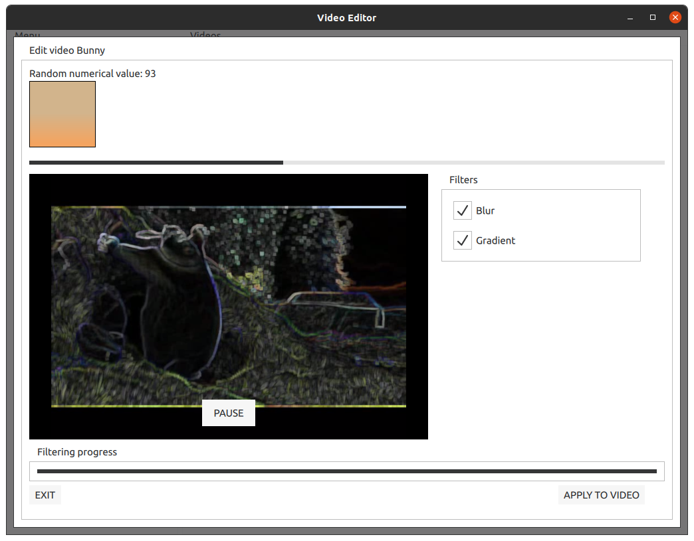

# QT video editor #

[](https://github.com/zpervan/QtVideoEditor/actions/workflows/git_ci.yml)

A QtQuick application video browser, player and editor for Ubuntu 20.04

### Requirements ###

- OS: Ubuntu 20.04
- C++ compiler: Clang 11.0
- C++ standard: 20  
- Build system: CMake 3.16.3

#### Additional libraries ####

- [Qt Framework](https://www.qt.io/product/framework)
- [OpenCV](https://opencv.org/)

### Setup ###

In order to run the application successfully, install the needed dependencies with the installation script
located in the `Scripts` folder. `sudo` privileges are needed.

Position your terminal at the root path of this project and execute the following commands:
```shell
chmod +x Scripts/install.sh # Give execution rights to the installation script
sudo ./Scripts/install.sh   # Execute the installation script
```
After the installation is finished, the project should be ready to use.

### Build ###

As your terminal is positioned at the root of the project, create a `build` folder in which the application executable
will be located. 
```shell
mkdir -p build
cd build
```

Run the `CMake` configuration files generation process with the following command:
```shell
cmake .. -DCMAKE_BUILD_TYPE=Release -DCMAKE_C_COMPILER=/usr/bin/clang-11 -DCMAKE_CXX_COMPILER=/usr/bin/clang++-11
```
Note here that we are using `clang-11` which includes the latest C++ standard, so it is mandatory to generate
the `CMake` configuration files with the latest `clang` version.

After the generation process is finished, run the build command:
```shell
cmake --build . -j 4 # The '-j 4' is optional, you can build it without it if needed
```

After the build process is finished, run the executable with the following command:
```shell
./QtVideoEditor
```

### Preview ###
As the application is in the development stage, the GUI layout functionalities might change.
Here is a sneak peek of current development progress.

- Main window

  
- Raw video media player


- Edit video window

